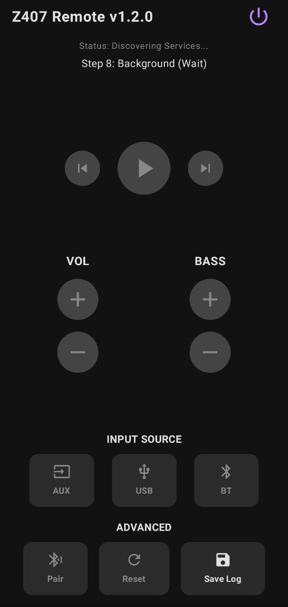

# Logitech Z407 Android Native Bluetooth Controller (Experimental)

  

An advanced Android application designed to control Logitech Z407 Bluetooth speakers directly using **Android's native Bluetooth stack**. This allows for portable control directly from your phone, distinguishing it from desktop-based solutions.

> **⚠️ CURRENT STATUS: WORK IN PROGRESS**  
> This application is currently in active development. Despite implementing aggressive connection strategies, **it currently struggles to establish a stable GATT connection with the Z407 speakers** due to the device's restrictive Bluetooth stack behavior on Android. It serves as a proof-of-concept and a base for further reverse-engineering.

## ✅ Working Alternatives (Desktop)

If you are looking for a **fully functional** remote control solution right now and valid connection cannot be established with this Android app, I have developed stable Web App controllers for desktop platforms that **work perfectly**:

*   🖥️ **Windows Version**: [Logitech Z407 Remote Control Web App - Windows](https://github.com/androrama/Logitech-Z407-Remote-Control-Web-App---Windows)
*   🐧 **Linux Version**: [Logitech Z407 Remote Control Web App - Linux](https://github.com/androrama/Logitech-Z407-Remote-Control-Web-App---Linux)

These PC versions successfully overcome the connection hurdles that are currently being researched in this Android project.

---

## 📌 Project Overview

The Logitech Z407 speakers use a proprietary BLE (Bluetooth Low Energy) protocol for their wireless control dial. This app attempts to reverse-engineer and emulate that protocol to allow volume control, bass adjustment, and input switching from an Android device via **standard Android Bluetooth**.

The main challenge is that the Z407 speakers do not easily expose their GATT services (needed for control commands) when they are already connected via standard Bluetooth Audio (A2DP). This project implements a sophisticated connection manager (`Z407Manager`) to overcome these limitations.

## 🛠️ Key Features (Implemented Strategies)

To fight the "0 services discovered" issue common with this device, this app includes a tiered "Connection Warfare" engine:

1.  **Smart Profile Management**: Automatically attempts to disconnect competing Bluetooth profiles (A2DP Audio, Headset, AVRCP) to free up the Bluetooth stack for data connection.
2.  **Aggressive GATT Bounce**: Performs rapid connect/disconnect cycles using different physical transport layers (Auto, LE, Classic) to wake up the speaker's internal GATT server.
3.  **Extended Discovery Wait**: Implements "patience mode," connecting and waiting silently for up to 10 seconds before requesting services, catering to slow initialization times.
4.  **Automatic Re-Bonding**: Can programmatically unpair (remove bond) and re-pair the device to clear OS-level Bluetooth caches that may hold corrupt data.
5.  **Nuclear Reset**: As a last resort, it can toggle the Android Bluetooth adapter off and on to reset the entire stack (Android < 13).
6.  **Blind Write Support**: Experimental support for writing directly to characteristic handles without service discovery, mimicking successful Python/Linux implementations.

## 📱 Tech Stack

*   **Language**: Kotlin
*   **Platform**: Android Native
*   **Architecture**: MVVM-like structure with a dedicated Bluetooth Manager singleton.

## 🤝 Contribution

If you have experience with Android BLE, specifically with stubborn devices that hide their GATT table behind A2DP connections, your help is welcome! 

The core logic resides in `Z407Manager.kt`. We are looking for solutions to reliably force the Z407 to list its services (`0000fdc2-0000-1000-8000-00805f9b34fb`) on Android.

## 📄 License

This project is for educational and research purposes.
